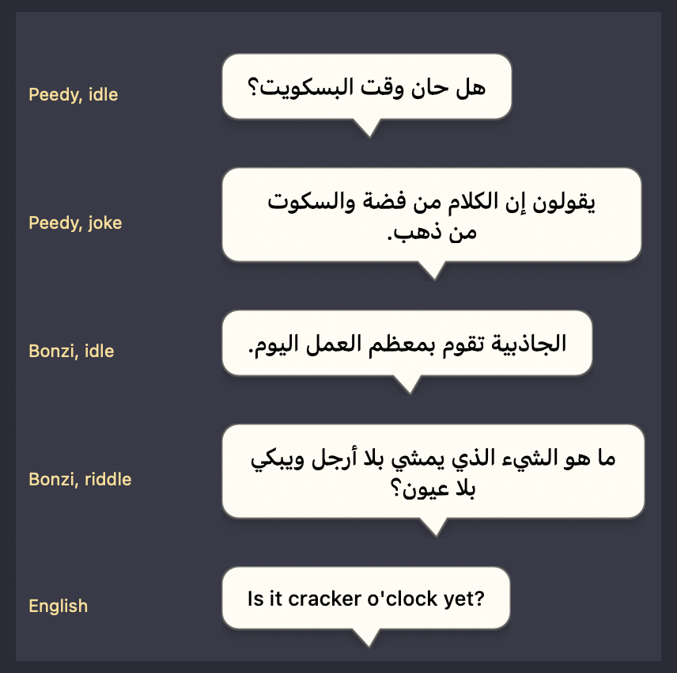

# Desktop Buddies

[](https://github.com/shadi0077/desktop-buddies/actions/workflows/ci.yml)
[](LICENSE)
-lightgrey)

Two characters who live on your macOS desktop. **Peedy** is a parrot: quick,
fussy, theatrical, opinions about crackers. **Bonzi** is a gorilla: slow, heavy,
unbothered, arrives on a vine. Have one, or both — and when both are out, they
talk to each other.

The Bonzi idea, minus the part everyone remembers it for: **no network access,
no analytics, no bundled anything, no browser changes, no upsell.** They are
windows that draw an animal. Quit them from the menu bar and they're gone.

📖 **[shadi0077.github.io/desktop-buddies](https://shadi0077.github.io/desktop-buddies/)**

---

> **Peedy:** You're very still.
> **Bonzi:** Thank you.
> **Peedy:** It wasn't a compliment.
> **Bonzi:** I'm taking it as one.

---

## Build and run

macOS 11 or later on Apple Silicon, plus the Xcode command line tools.

```bash
git clone https://github.com/shadi0077/desktop-buddies.git
cd desktop-buddies
./build.sh && open build/Peedy.app
```

> **On the artwork.** Peedy and Bonzi are Microsoft Agent characters. The
> sprites are included so this runs from a clone, but they are **not** covered
> by the MIT licence and are not mine to license — see
> [docs/SPRITES.md](docs/SPRITES.md). Rights holders: open an issue and it comes
> down.

There is no Xcode project. `build.sh` compiles the sources with `swiftc`,
assembles `build/Peedy.app`, and ad-hoc signs it.

## The cast

| | Peedy | Bonzi |
|---|---|---|
| Register | quick, fussy, theatrical | slow, heavy, unbothered |
| Voice | Fred, pitched up | Ralph, pitched down |
| Rate | 0.52 | 0.44 |
| Beat interval | 9–22 s | 14–32 s |
| Travel | flies — takeoff, cruise, landing | swings, no takeoff |
| Entrance | flies in from the distance | swings in on a vine |
| Bits | newspaper, notepad, headphones, sunglasses, telescope, ribbon | banana, coconuts, book, globe, headphones, sunglasses, a puff of smoke |
| Songs | Daisy Bell, Twinkle, Row Your Boat, Polly Wolly Doodle | Swing Low, Coming Round the Mountain, Michael Row the Boat |

They share general knowledge — neither has a claim on octopuses — but their
small talk, jokes, songs and themed facts are entirely separate, and `test.sh`
asserts those pools stay disjoint.

### Them talking to each other

When both are on screen and both are free, they fall into an exchange. The
comedy is all in the contrast; neither wins:

> **Peedy:** You're very still.
> **Bonzi:** Thank you.
> **Peedy:** It wasn't a compliment.
> **Bonzi:** I'm taking it as one.

**Let Them Chat** in the menu bar starts one on demand, gathering them together
first if they've drifted apart. Two rules make it read as conversation rather
than two monologues: nobody starts a line while somebody else is mid-sentence,
and arrivals are staggered so they don't greet in unison.

## Arabic — Saudi

Both characters speak **Najdi Arabic**, switchable from **Language** in the
menu. The menu localises with them and speech balloons lay out right-to-left.



Dialect, not textbook. `وش لونك` rather than `كيف حالك`, `أبغى` rather than
`أريد`, and the riddles are asked the way people actually ask them — `وش الشي
اللي...`. The jokes are local: coffee and dates, the heat, the five minutes that
turn into an hour, the last five minutes of the working day.

> **بيدي:** قال لي بجي بعد خمس دقايق... صار لي ساعة وأنا أعدّ.
>
> **بونزي:** ليش ما أستعجل؟ الشجرة ما بتروح.

Only the facts carry across from English, because facts are facts — and even
those are phrased in the same register. The songs are original: almost every
Arabic song anyone would recognise is firmly in copyright.

### What the voice can and can't do

macOS exposes exactly one Arabic voice, **Majed** (`ar-001`), and its phonetics
are Modern Standard. It says *qahwa*, not *gahwa*. Nothing in software changes
that — so the **dialect is Saudi and the pronunciation is fusḥa**, which is a
perfectly ordinary way to read dialect aloud, but it is not a Saudi accent.

If a Saudi voice is ever installed, the app picks it up with no code change:
`preferredLocales` asks for `ar-SA` first and only falls back to `ar-001`.

What *is* controllable, and used:

- **Vocabulary and syntax**, which is most of what makes speech sound local, and
  costs nothing — measured, Majed reads dialect spelling at 104–119 ms/char
  against MSA's 110–119. (I had assumed dialect would make it stumble; it
  doesn't. Worth measuring before believing.)
- **Pauses.** Commas and ellipses are the one handle on cadence: `يا هلا والله
  حياك` runs 2.13 s, `يا هلا... والله... حياك` runs 2.54 s. Najdi speech leans
  on pauses, so the lines are punctuated for it.
- **Pitch and pace.** Both characters share the one voice, so this is all that
  separates them: Peedy near 284 Hz, Bonzi near 128, and Bonzi much slower.

`test.sh` renders all 356 Arabic lines and checks each reads at a normal rate —
a line the voice can't handle shows up as a spike in ms/char, the signature of
it spelling something out. It also checks the text is dialect rather than MSA,
and that no Latin characters have crept in.

## Using them## Using them

| | |
|---|---|
| Click | They react |
| Drag | Pick one up and put it somewhere else |
| Right-click | Same menu as the menu bar |
| Menu bar icon | Jokes, facts, songs, Let Them Chat, Who's Here, volume, per-character voice and pitch |

**Volume** is theirs alone — a slider in the menu, independent of the system
volume. Turning them down doesn't quieten anything else, and turning the Mac up
doesn't make them shout. It's gain on the player node rather than something
baked into the render, so it takes effect mid-sentence, and the lip sync is
unaffected: the mouth follows the clip's own normalised envelope, so the beak
moves identically at 5% and 100%. `test.sh` asserts exactly that.

**Chattiness** controls how often they do anything: Quiet, Occasional
(default), Chatty. It scales each character's own pacing rather than replacing
it, so a quick bird and a slow gorilla stay quick and slow. **Size** is Small /
Medium / Large. **Mute Voices** silences both in one click. All of it persists
between launches, including who was on screen and where they were standing.

They are non-activating floating panels, so they never steal focus, follow you
across Spaces, and sit above normal windows without blocking clicks — only the
opaque pixels of the character itself take mouse events.

### Can't see the menu bar icon?

It's whoever is out, in miniature — 18pt, drawn from the sprite sheet rather
than an SF Symbol, because a generic monochrome bird is very hard to pick out of
a crowded bar. If it isn't showing at all, something is hiding it rather than
failing to create it. **Bartender, Ice** and similar menu-bar managers hide
unrecognised items by default; look in their hidden-items list. macOS also parks
items off-screen when the bar is full, which on a notched MacBook happens sooner
than you'd expect.

Either way you're never locked out: **right-clicking either character opens the
same menu.** The item sets an `autosaveName`, so once you place or unhide it,
that choice sticks.

## Compatibility

**macOS 11 Big Sur and later, Apple Silicon** — every macOS version that has
ever shipped on an Apple Silicon Mac. `test.sh` asserts the binary's `minos` and
`Info.plist` agree on 11.0 and that an arm64 slice is present, so this can't
regress quietly.

Two things degrade rather than break on older systems:

| | macOS 11–12 | macOS 13+ |
|---|---|---|
| Menu-bar icon | silhouette cut from the sprite sheet | full-colour sprite |
| Open at Login | offers to open Login Items in System Preferences | one-click toggle via `SMAppService` |
| Voices | Fred, Ralph, Junior, Albert, Zarvox | those plus Eloquence (Grandpa, Eddy) |

SF Symbols didn't have a bird until macOS 13, and `NSImage(systemSymbolName:)`
just returns nil for a symbol it doesn't know — a silently blank status item,
which for a menu-bar-only app means no way in at all. Speech falls back to
ordinary playback without lip sync if buffer rendering isn't available, and both
fallbacks are covered by tests.

For Intel Macs as well, build each slice and `lipo` them together — the sources
need no changes.

## Feeling alive

A desktop pet is dead the moment you can feel the timer behind it. Five things
do most of the work here:

**Energy.** A single 0–1 value that rises when something happens to him and
decays back toward a baseline. Everything about his rhythm reads off it — the
gap between beats, how often he blinks, and which kind of beat he picks. Lively
means shorter gaps and more moving about; winding down means small, still beats
and long pauses. Without it every gap is drawn from the same flat distribution
and the tempo never changes.

**He knows whether you're there.** `CGEventSource.secondsSinceLastEventType`
gives seconds since the last keyboard or mouse event, needs no permission at
all, and is the difference between a pet and a screensaver. Away for three
minutes and his baseline energy drops to 0.12 — he settles down rather than
performing to an empty room. Come back and he perks up and says so.

**He notices the cursor.** Come within 250 pt and he leans and points at it;
shoot past and he startles. This is edge-triggered on the cursor *arriving*,
not level-triggered on it being nearby — the first version greeted a parked
cursor every nine seconds forever, which reads as a stuck loop rather than
attention. There's also a speed floor so a motionless cursor doesn't count as
an arrival when it's he who moved.

**Blinking has its own clock.** Every 1.6–6 s, irregular, faster when he's
alert, occasionally a double. It's the cheapest possible fix for the deadest
possible tell: eyes that never move. It's deliberately confined to idle rest —
see the note below.

**He gets bored of you.** Poke him repeatedly and the reaction decays:
startled, then playful, then visibly tiring of it, then nothing but a blink.
Stop for seven seconds and it resets. Paired with a short memory of recent
lines and animations, so he stops saying "Careful, the feathers are
load-bearing" three pokes running — which is what the earlier traces actually
showed him doing.

Not every beat produces a movement, either. A settle beat is often just staying
put, which is what real animals spend most of their time doing.

### A soft-lock worth knowing about

Blinking only ever happens over idle rest. A "bit" — reading, writing,
headphones — owns the animator across its whole intro/loop/outro sequence and
hands back through a deferred callback guarded by a generation token. An
independent blink that bumped that token, or that replaced the loop clip
mid-flight, would strand him reading a newspaper forever. The blink now captures
the generation rather than bumping it, so it can be invalidated by other work
but can never invalidate anyone else's.

## What they actually do

Beyond fidgeting, he has a repertoire — all of it bundled, since he has no
network access and never will.

| | |
|---|---|
| **Jokes** | 25, told properly: setup, a beat to let it land, then the punchline with a flourish |
| **Facts** | 32, and they're all true — parrots, birds, computing history, and assorted trivia |
| **Riddles** | 12, with a longer pause before the answer so you can have a go |
| **Tongue twisters** | 7, which a formant synthesiser makes funnier than they deserve |
| **Songs** | 4, actually sung — see below |

Jokes, facts and songs are on the menu directly; riddles and tongue twisters are
under **More**. They also come up on their own as he idles. Recent picks are
remembered so he works through the material rather than looping a favourite.

### When there's no audio device

`AVAudioPlayerNode.play()` raises "player did not see an IO cycle" — an ObjC
exception Swift cannot catch, so a hard crash — if it lands before the engine's
IO thread has cycled. `engine.isRunning` is *not* proof that it has: with no
usable output device it returns true while nothing ever renders.

So the engine is started at launch and left running, and a tap on the main mixer
provides the only trustworthy signal — its first callback means a render cycle
happened. Playback waits for that, and if it never comes he **mimes**: the
bubble still keeps time and the beak still opens on the right syllables, there
is simply no sound. Much better than going silent and still, and far better than
crashing. `test.sh` covers that path.

### Singing

They actually sing — a real melody, in tune.

The obvious approach does not work, and the numbers say why. Rendering each
syllable as its own utterance and letting `pitchMultiplier` carry the tune gave,
measured across Twinkle:

| | before | after |
|---|---|---|
| Worst interval error | **3.4 semitones** | **0.05 semitones** |
| Pitch movement within a note | 5–31 semitones | steady |
| Silence between notes | 11–34% | none — notes butt together |
| Length vs the written score | ~2× long | exact |

The synthesiser applies sentence intonation to every isolated word, so each
"note" was a swoop rather than a tone, and the tune was unrecognisable.

So the pitch is taken away from it, by **time-domain PSOLA**: find the source's
glottal pulses, cut one grain per pulse, and lay those grains down again at
exactly the target period. The grains carry the syllable's formants; their new
spacing dictates the pitch. Output length is chosen rather than inherited, so
notes join without padding and the line is legato.

Three things that each mattered, and each showed up as a specific measured failure:

- **Grains must be pitch-synchronous.** Overlap-adding at arbitrary phase makes
  grains cancel instead of reinforce; the first attempt was *worse* than doing
  nothing (14-semitone errors). Snapping each grain to a local energy peak fixes it.
- **The fundamental is the *first* strong autocorrelation peak**, not the last.
  Scanning from the long end looks like it avoids locking onto a harmonic, but
  lands on a sub-harmonic — it reported 196 Hz as 96 Hz.
- **Measure the voice once, not the syllable.** Detecting the period of a single
  short syllable is unreliable: "sw" and "ch" read as harmonics, and PSOLA on a
  wrong period lets the source pitch leak through. Each voice's natural pitch is
  measured once over a long voiced phrase (Fred 114 Hz, Ralph 79 Hz) and the
  syllable is rendered at a known multiplier, so its pitch is known rather than
  guessed.

Consonants keep their natural speed and the vowel absorbs the stretch, so a
two-beat note is a held vowel rather than a drawn-out "st".

`tools/dsptest` validates the resynthesis on synthetic signals where the answer
is known — pitch imposed to within 0.1 semitones from 98 to 330 Hz, exact
durations, steady notes, consonants preserved on long notes — so a failure there
is unambiguously the DSP rather than the speech synthesiser.
`tools/singanalyze <character>` prints the per-note report for a real song.

Songs are transposed per character rather than per song: Peedy's tonic is 196 Hz
(G3), Bonzi's 123 Hz (B2), roughly an octave apart.

## The voices

They talk. MS Sam is a Windows SAPI voice and isn't ours to ship, so he uses the
nearest thing macOS has: **Fred**, the classic MacinTalk formant synthesiser —
same era, same flat robotic register. Ralph, Junior, Albert, Zarvox and the two
Eloquence voices (Grandpa, Eddy) are in the **Voice** submenu; picking one
auditions it. Only voices actually installed on the machine are listed.

He is pitched up from there, because he is a parrot rather than a Windows
dialog box. `pitchMultiplier` tracks the fundamental almost exactly linearly on
Fred, whose natural F0 is about 116 Hz, so the **Pitch** menu measures out as:

| setting | multiplier | measured F0 |
|---|---|---|
| Deep | 0.85 | 100 Hz |
| Low | 1.15 | 133 Hz |
| High *(default)* | 1.50 | 174 Hz |
| Squeaky | 1.85 | 212 Hz |

Those numbers are measured by autocorrelation in `test.sh`, not taken on faith —
some voices ignore the pitch request entirely, and the test would catch that.
Pitch does not affect the lip sync, which is amplitude-based.

**The beak follows the audio, not a timer.** Each line is rendered to PCM before
anything plays, which buys two things a plain `speak()` can't: the exact
duration up front, so the bubble matches the speech instead of guessing from
string length, and a loudness envelope to pick a viseme from every frame.

Two findings shaped this:

- MS Agent drove its seven mouth shapes from phonemes, and `NSSpeechSynthesizer`
  used to expose a phoneme callback. On current macOS it never fires and
  `phonemesFromText:` returns error -50 — so phoneme-accurate sync is off the
  table. Word-boundary callbacks still work, but loudness is finer-grained.
- Linear loudness is bimodal for speech: nearly every sample lands near silence
  or near the peak, so the beak just slams between shut and wide and the five
  shapes in between never appear. Mapping to dB over a 30 dB window spreads them
  evenly — roughly `22/9/10/8/3/24/23` across the ramp, against `22/15/7/4/5/5/41`
  for linear. `tools/tune` is the experiment those numbers came from.

The seven patches per pose are visemes, not an openness ramp, so `tools/catalog.py`
orders them closed → widest by measuring the vertical span of beak-yellow pixels.
Index 4 is widest in all six poses and 0/5/6 cluster as near-closed, giving
`[0,5,6,1,2,3,4]`. See `shots/lipsync.png` for a spoken line rendered frame by
frame against its envelope.

## How it works

`assets/` holds the original 705-frame Peedy sprite dump. Those frames are not
a simple flipbook: the background is a cyan colour key, and only about 70% of
the frames are full bodies. The rest are small patches meant to be composited
over a held pose — groups of seven are lip-sync mouth shapes, groups of two are
eye blinks. The tooling in `tools/` reverse-engineers that structure:

| script | what it does |
|---|---|
| `extract.py` | Keys out cyan (`#00FFFF`) to alpha, measures every frame |
| `pack.py` | Trims each frame to its opaque bounds, records the offset |
| `catalog.py` | Emits the animation catalog (clip ranges, fps, loop flags) |
| `strips.py`, `detail.py` | Labelled contact sheets used to identify the clips |
| `icon.py` | Builds `AppIcon.icns` from a hero frame |

Rerun the whole pipeline with:

```bash
python3 tools/extract.py && python3 tools/pack.py && python3 tools/catalog.py
```

The app ships 36 named clips (`rest`, `arrive`, `depart`, `takeoff`/`fly`/`land`,
plus bits like reading a newspaper, taking notes, headphones, sunglasses,
telescope, and a first-place ribbon) and six lip-sync poses. Costume bits have
no "take it off" frames in the source set, so their intro clip is played
backwards to undo it — which is what the original did too.

### Code

| file | role |
|---|---|
| `SpriteStore.swift` | Manifest loading, lazy frame decode, `NSCache` |
| `BuddyView.swift` | Composites body + overlay, mirrors for direction, pixel-accurate hit testing |
| `Animator.swift` | One 60 Hz tick drives both the sprite clock and motion |
| `Brain.swift` | Behaviour state machine — idle beats, wandering, reactions |
| `SpeechBubble.swift` | Balloon drawn as a single continuous path so the tail has no seam |
| `Voice.swift` | Renders speech and song to PCM, imposes sung pitch, plays it, exposes a live loudness level |
| `VolumeSlider.swift` | The app's own volume control, in the menu |
| `Cast.swift` | Assembles each character; runs the two-hander dialogue |
| `Personality.swift` | What makes one of them not the other — voice, pacing, clips, lines |
| `Banter.swift` | The exchanges between them |
| `Chatter.swift` | The few lines that read the same in either mouth, and the no-repeat picker |
| `Repertoire.swift` | Shared facts and riddles, and the songs as note data |
| `AppDelegate.swift` | Menu bar item, preferences, login item |

Set `PEEDY_DEBUG=1` to trace behaviour decisions on stderr:

```bash
PEEDY_DEBUG=1 ./build/Peedy.app/Contents/MacOS/Peedy
```

### Tests

```bash
./test.sh
```

Checks the wander target maths (the edge cases are the whole point), asserts the
lip-sync registration invariant, exercises the speech path end to end, and
renders every animation headlessly through the real `BuddyView` into `shots/`.

**The lip-sync invariant:** a mouth patch is drawn to register with exactly one
body frame, so it may only ever be composited onto that frame. Put one on any
other pose and you get a rectangle of beak floating in the middle of the bird.
`Animator.render()` enforces this, `tools/talktest` proves it, and poses with no
mouth patches in the sprite set (headphones, sunglasses, monocle) simply speak
with a still beak. The brain also refuses to start an idle beat mid-sentence,
since that would animate the body out from under the mouth.

`tools/render/main.swift` renders animations headlessly through the real
`BuddyView` — useful for checking frame registration without a screenshot:

```bash
swiftc -O -framework AppKit app/Sources/SpriteStore.swift app/Sources/BuddyView.swift \
  app/Sources/SpeechBubble.swift tools/render/main.swift -o build/render && ./build/render
```

Output lands in `shots/`.

## Contributing

See [CONTRIBUTING.md](CONTRIBUTING.md) — it covers getting it running, the three
failure modes that have bitten repeatedly, and how to add a third character.

## Licence

MIT, for the code. See [LICENSE](LICENSE).

## Sprites

Peedy is a Microsoft Agent character. The frames came from the sprite dump you
supplied; they are used here as-is and are not mine to license. Fine for
personal use — check before shipping this anywhere.
