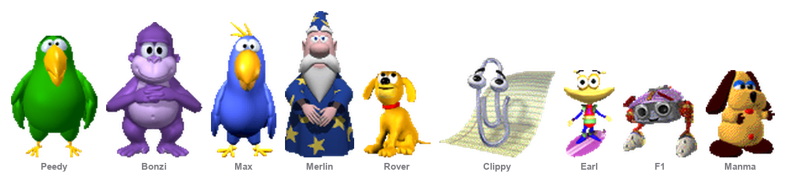
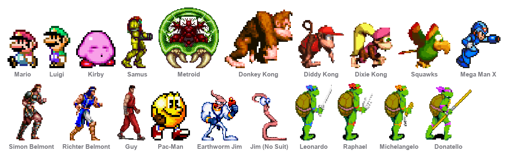

# Desktop Buddies

[](https://github.com/shadi0077/desktop-buddies/actions/workflows/ci.yml)
[](LICENSE)
-lightgrey)

Two macOS desktop-pet apps, one engine. Characters who live on your desktop:
they walk about, do the things their source material had them do, react to your
cursor, and talk to each other when more than one of them is out.

📖 **[shadi0077.github.io/desktop-buddies](https://shadi0077.github.io/desktop-buddies/)**

## The three apps

### 🦜 Desktop Buddies — [full documentation](docs/desktop-buddies.md)



Nine Microsoft Agent characters, from the era when software came with a cartoon
in the corner: **Peedy**, **Bonzi**, **Max**, **Merlin**, **Rover**,
**Clippit**, **Earl**, **F1** and **Manma**. They have voices — real speech with
the mouth driven by the audio's own loudness envelope — and they sing actual
melodies in tune. They tell jokes, know facts, ask riddles, and fall into
exchanges with each other. All nine speak Najdi Arabic as well as English.

```bash
./build.sh desktop-buddies && open "build/Desktop Buddies.app"
```

### 🎮 MegaDrive Buddies — [full documentation](docs/megadrive-buddies.md)


Thirty-seven sixteen-bit sprites — the Streets of Rage cast, the Sonic cast,
Ristar, the Hyperstone Heist turtles, Earthworm Jim, Ryu, Terry Bogard, Michael
Jackson and more. They pace the length of the screen at their own speeds and
square up when two of them get close. They talk in **speech bubbles with no
voice**, about video games up to 1997 and nothing after, and they grunt and thud
with the sound effects out of their own games.

```bash
./build.sh megadrive-buddies && open "build/MegaDrive Buddies.app"
```

### 🕹️ SNES Buddies — [full documentation](docs/snes-buddies.md)



Twenty Super Nintendo characters — Mario, Luigi, Kirby, Samus, the last Metroid,
the Donkey Kong Country four, Mega Man X, both Belmonts, Guy, Pac-Man, the
Turtles in Time four, and Earthworm Jim in and out of his suit. Seventeen walk,
Squawks flies, the Metroid floats, and Jim, out of the suit, squirms. They talk
in speech bubbles like the Mega Drive cast, and they are silent: no rip of these
games' audio is to hand, and borrowing Sega's grunts would be worse.

```bash
./build.sh snes-buddies && open "build/SNES Buddies.app"
```

No app here has network access, analytics, bundled anything, or an upsell. They
are windows that draw a character. Quit them from the menu bar and they're gone.
They keep separate bundle identifiers, so both can run at once with their own
characters, positions, volume and size.

---

## Build and run

macOS 11 or later on Apple Silicon, plus the Xcode command line tools. The
sprites are committed, so a clone builds and runs directly:

```bash
git clone https://github.com/shadi0077/desktop-buddies.git
cd desktop-buddies
./build.sh                 # both apps
open "build/Desktop Buddies.app" "build/MegaDrive Buddies.app"
```

There is no Xcode project. `build.sh` compiles the sources with `swiftc`,
assembles each `.app`, and ad-hoc signs it — 18 MB and 13 MB, a few seconds each.

> **On the artwork.** Nothing under `app/Resources/characters/` is mine to
> license, and none of it is covered by the MIT licence — the Microsoft Agent
> characters belong to Microsoft, Bonzi Software and the Office XP set's owners;
> the game sprites and sounds to Sega, SNK, Capcom, Konami, Interplay, Disney,
> Marvel and others. It is all included so this runs from a clone. See
> [docs/SPRITES.md](docs/SPRITES.md). Rights holders: open an issue and it
> comes down.

## One codebase, three apps

A product is a JSON manifest in `products/` — a name, a bundle identifier, and
a cast:

```json
{
  "id": "megadrive-buddies",
  "name": "MegaDrive Buddies",
  "bundleID": "com.shadi.megadrivebuddies",
  "cast": ["axel", "blaze", "sonic", "ristar", "..."],
  "iconCharacter": "axel",
  "iconFrame": 157
}
```

`build.sh` reads it, writes the `Info.plist`, and copies only the sprite folders
that cast actually uses — including only the frames its animations reference,
which is most of the difference between 88 MB of committed artwork and two apps
that come to 31 MB together. At runtime `Product.swift` loads the bundled copy and
`Personality.all` filters the roster to match, so a character can be built and
kept out of a release by deleting one line.

The manifest also decides what the app *is*. `Product.isSilent` is true when
nobody in the cast has a voice, and that one flag takes the Language submenu,
the voice and pitch controls and the singing out of the menus, and swaps **Let
Them Chat** for **Let Them Fight**. `test.sh` reads the same manifests, which is
why adding a character doesn't mean remembering to add it to three other places.

Adding a third app is a JSON file and `./build.sh <id>`: no target, no project
file, and nothing in the Swift sources needs to know it exists.

## The shared engine

| file | role |
|---|---|
| `SpriteStore.swift` | Frame atlas loading, lazy decode, `NSCache` |
| `BuddyView.swift` | Composites body + overlay, mirrors for direction, pixel-accurate hit testing |
| `Animator.swift` | One 60 Hz tick drives both the sprite clock and motion |
| `Brain.swift` | Behaviour state machine — idle beats, wandering, reactions, speech |
| `Cast.swift` | Assembles each character; runs the dialogue and the sparring |
| `Personality.swift` | What makes one of them not the other |
| `SpeechBubble.swift` | The balloon — soft and round for the cartoons, hard-edged for the sprites |
| `Voice.swift` | Renders speech and song to PCM, imposes sung pitch, exposes a live loudness level |
| `SoundBank.swift` | The games' sound effects, and which one suits which move |
| `Product.swift` | Reads the bundled manifest: the name, who ships, and whether anyone speaks |
| `VolumeSlider.swift` | The apps' own volume control, in the menu |
| `AppDelegate.swift` | Menu bar item, preferences, login item |

Everything below the personality layer is shared. What differs is in the data:
who is in the cast, how they move, and whether they have a voice or a text box.

## Feeling alive

Both apps run the same four ideas, because a desktop pet is dead the moment you
can feel the timer behind it:

**Energy** — a single 0–1 value that rises when something happens to a character
and decays back toward a baseline. The gap between beats and the kind of beat
picked both read off it, so the tempo changes rather than being drawn from one
flat distribution.

**They know whether you're there.** `CGEventSource.secondsSinceLastEventType`
needs no permission at all and is the difference between a pet and a
screensaver. Away for three minutes and the baseline drops to 0.12.

**They notice the cursor** — edge-triggered on it *arriving*, not
level-triggered on it being nearby, because the first version greeted a parked
cursor every nine seconds forever.

**They get bored of you.** Poke one repeatedly and the reaction decays to
nothing; stop for seven seconds and it resets.

Each app's own documentation has the rest: [lip sync, singing and
Arabic](docs/desktop-buddies.md) for the cartoons, [sheet cutting, sparring and
the 1997 cutoff](docs/megadrive-buddies.md) for the sprites.

## Tests

```bash
./test.sh
```

One suite covers both apps — eighteen sections and about 1900 assertions:
deployment target, both casts' clips against their sprite sets, the lip-sync
registration invariant, the wander maths, the speech path end to end, the
written content (no duplicate lines anywhere, and nothing the Mega Drive cast
says referencing a year after 1997), and headless renders of every animation
through the real `BuddyView` into `shots/`.

It takes about fifteen minutes, almost all of it rendering real audio.
`SKIP_AUDIO=1 ./test.sh` runs the rest in seconds, which is what CI does.

## Contributing

See [CONTRIBUTING.md](CONTRIBUTING.md) — it covers getting it running, the
failure modes that have bitten repeatedly, how to add a character to either
app, and how to add a third app.

## Licence

MIT, for the code. See [LICENSE](LICENSE).

## Sprites

None of the character artwork is mine to license and none of it is covered by
the MIT grant. Fine for personal use — check before shipping this anywhere. See
[docs/SPRITES.md](docs/SPRITES.md).
