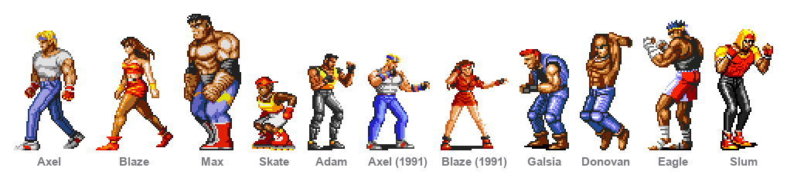

# MegaDrive Buddies

Eleven Streets of Rage characters, shipped as their own app. They live in the
same repository and run on the same engine as Peedy and Bonzi — adding them is
what established that the engine could host something other than a Microsoft
Agent character.

```bash
./build.sh megadrive-buddies && open "build/MegaDrive Buddies.app"
```



| | |
|---|---|
| Streets of Rage 2 | Axel, Blaze, Max, Skate |
| Streets of Rage 1 | Adam, Axel, Blaze |
| Enemies | Galsia, Donovan, Eagle, Slum |

Both games have an Axel and a Blaze, seven years apart, so the older pair show
as *Axel (1991)* and *Blaze (1991)* in the menu. `python3 tools/lineup.py
megadrive-buddies` regenerates the picture above.

They are not variations on Peedy and Bonzi. These are beat-'em-up sprite rips,
and almost everything that makes the other two work does not apply to them:

| | Peedy / Bonzi | Axel |
|---|---|---|
| Source | numbered PNG frames, one per file | one 696×1688 sheet |
| Background | cyan `#00FFFF` | light green `#CCFFCC` |
| Mouth frames | seven visemes per pose | none |
| Expression | speech, lip-synced to the audio | game sound effects |
| Scaling | smoothed — they're 3D renders | nearest-neighbour — pixel art |
| Blinking | eye patches, own clock | no blink frames at all |

## Cutting the sheet

`tools/sheet.py` segments a sheet into frames: find horizontal bands of
content, then columns within each band, then trim each to its own bounding box.
The four sheets give 162, 186, 150 and 137 frames, and their bands map almost
one-to-one onto animations — idle, walk, jab, kick, the Grand Upper, knockdown,
and the portrait art at the end.

One trap worth knowing: a caption printed directly above a sprite ends up
*inside* that frame, because the band containing both is one run of content.
Those frames are a normal size, so nothing can filter them out automatically.
Blaze's walk cycle starts two frames later than it looks like it should for
exactly this reason, and the only way to catch it is to render the numbered
index and look.

Frames are anchored bottom-centre on a shared canvas so his feet stay planted.

## Sound instead of speech

`SoundBank` plays short one-shots through `AVAudioPlayer` rather than the engine
the speaking characters use — these want firing and forgetting, and
`AVAudioPlayer.play()` returns false on a dead audio device instead of raising
the uncatchable exception `AVAudioPlayerNode` does.

Every animation makes a fitting noise, chosen by clip name: specials and
celebrations shout, knockdowns thud, everything else grunts.

The rip names voice clips `V00`–`V52` and effects `00`–`49`, with no index of
what each one is — nobody wrote down which grunt is which. The grouping is by
that naming convention plus duration: short voice clips are exertion, short
effects are impacts, longer voice clips are shouts. It's an inference, not a
transcription.

## Moving about

They walk, so they travel at walking pace and go a long way with it. `Roaming`
carries a distance range, a speed in points per second, an arc height and a
restlessness — because a walk cycle played while the window jumps 500 points in
half a second reads as moonwalking, which is what it looked like before this
existed.

| | distance | speed | arc | restlessness |
|---|---|---|---|---|
| Peedy | 160–520 | 620 pt/s | 42 | 1.0 |
| Bonzi | 200–560 | 400 pt/s | 16 | 1.0 |
| Axel | 600–2200 | 165 pt/s | 0 | 2.6 |
| Max | 500–1600 | 120 pt/s | 0 | 1.6 |
| Skate | 900–3000 | 300 pt/s | 0 | 3.4 |

Measured on Axel: 102 position changes over one stretch, 1846 points travelled,
largest single step 38 points.

## Squaring up

Two of them close together stop wandering and have a go at each other. It's the
same shape as the speaking characters' banter — take turns, face each other,
nobody moves while somebody else is mid-swing — but the content is physical,
because they have no words. One swings, the other takes it or blocks, then
counters.

Proximity is the trigger: under 420 points apart and both free, they square up.
**Let Them Fight** in the menu walks two together first.

Facing matters here and didn't before. Every sprite set faces the viewer's left
unmirrored, so `Brain.face(toward:)` mirrors to look right — and whoever isn't
swinging still turns to watch.

## Two traps in the source art

Both were found by rendering the frames and looking, and neither could have been
caught automatically:

**Captions live inside frames.** A label printed directly above a sprite is part
of the same run of content, so it ends up in that frame. Those frames are a
normal size, so no filter catches them. Blaze's walk starts two frames later
than it looks like it should. I tested whether an unusually-short-frame rule
would help; it would have thrown away her projectile and her lying-down poses
instead.

**The Streets of Rage 1 rips have no whole-body walk.** That game composited a
walk from separate torso and leg sprites, so frames 3–10 of each character are
disembodied legs. The trio glide on their idle and roam much less, which is
better than animating a pair of trousers across the desktop.

## What this changed in the engine

Adding him surfaced a pile of assumptions that only held because both existing
characters came from the same sprite set:

- `SpeechPack` is now optional on `Personality`. A character can have none.
- The shared routines named clips like `cheer` and `lookAround` directly. They
  now go through `move(_:)`, which drops any clip the character hasn't got and
  falls back to its own flourishes. Axel was performing `cheer` — a clip that
  doesn't exist — and silently doing nothing.
- Blinking is guarded on the clip existing, rather than assumed.
- Interpolation is per-character, so pixel art isn't blurred.
- A character who doesn't speak no longer constrains which languages are on
  offer.

`tools/casttest` covers all of it, and caught the missing clips itself.

## Why a separate app

They could have been one app with thirteen characters and a picker. They aren't,
because the two casts want different menus — half of Desktop Buddies' menu needs
a voice, and nobody here has one — and because a single bundle would carry both
sprite sets whichever pair you actually use.

So `products/megadrive-buddies.json` names the cast, `build.sh` copies only
those sprite folders, and `Product.swift` filters the roster at launch. Separate
bundle identifiers mean both apps can be open at once, each remembering its own
characters, positions, volume and size. The code is shared entire; the manifest
is the only thing that differs.

`test.sh` runs the cast checks once per product, with `BUDDY_PRODUCT` selecting
which — so a clip that only Desktop Buddies' characters have can't quietly
become a requirement for everyone.
